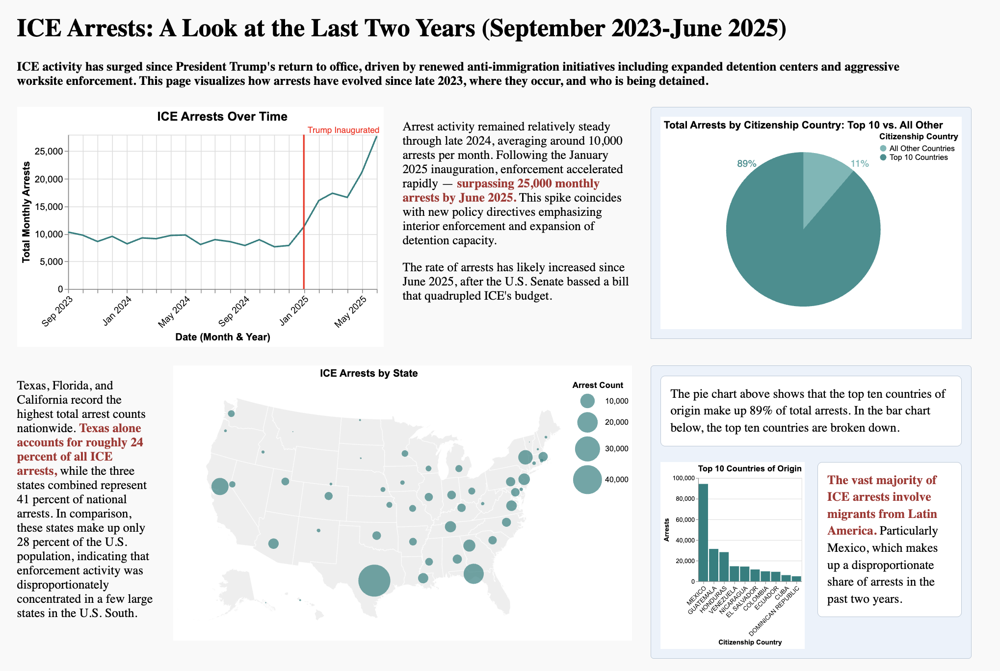

# ICE Deportations  
**Author:** Begum Akkas  

## Description  

This poster visualizes trends in **U.S. Immigration and Customs Enforcement (ICE) arrests and deportations** between **September 2023 and June 2025**, highlighting the surge in enforcement activity following President Trump’s return to office.  

The visualization shows:  
- Monthly trends in total ICE arrests.  
- Geographic concentration of arrests across U.S. states.  
- The top countries of citizenship among arrestees and deportees.  
- The share of individuals deported to countries *different from their citizenship*.  
- Distributions of age, gender, and processing time from arrest to deportation.  

The goal of the project is to **communicate changes in ICE enforcement visually**, using clean, data-driven design and accessible poster formatting suitable for print or digital presentation.  

---

## Project Preview 

  

---

## Project Structure

```
├── README.md
├── data
│   └── arrests-latest.xlsx
├── milestones
│   └── static_draft.md
├── src
│   └── graphs.ipynb
├── static-viz
│   ├── charts
│   │   ├── age_histogram.svg
│   │   ├── arrests_by_state.svg
│   │   ├── arrests_over_time.svg
│   │   ├── citizenship_country.svg
│   │   ├── density_days.svg
│   │   ├── diff_countries_heatmap.svg
│   │   ├── heatmap_criminality.svg
│   │   ├── heatmap_method.svg
│   │   ├── pie_deportations.svg
│   │   ├── pie_top10_countries.svg
│   │   └── time_diff_countries_unknown.svg
│   └── report.html
└── uv.lock
```

## Data Sources

- **ICE FOIA Data:**  
  U.S. Immigration and Customs Enforcement (ICE) data provided through a **Freedom of Information Act (FOIA)** request.  
  Accessed via the [Deportation Data Project](https://deportationdata.org/data/ice.html).  

## References


---

## Technical Notes  

- Built with **HTML + CSS grid layouts** for responsive poster formatting.  
- Charts created with **Altair** and exported as **SVG** files for print-quality resolution.  
- Poster optimized for **17 × 27 inch full-bleed printing (no margins)**.  
- Color themes emphasize clarity and contrast, using light blue and sand backgrounds for visual grouping.  

---

## Acknowledgments  

This visualization was completed for coursework in **Data Visualization (University of Chicago, Fall 2025)**. Special thanks to James Turk and peers for feedback on visual design and communication.  
