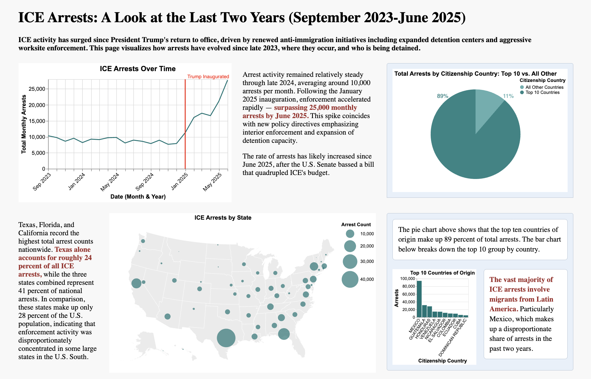

# ICE Deportations  
**Author:** Begum Akkas  

## Description  

This poster visualizes trends in **U.S. Immigration and Customs Enforcement (ICE) arrests and deportations** between **September 2023 and June 2025**, highlighting the surge in enforcement activity following President Trump’s return to office.  

The visualization shows:  
- Monthly trends in total ICE arrests.  
- Geographic concentration of arrests across U.S. states.  
- The top countries of citizenship among arrestees and deportees.  
- The share of individuals deported to countries *different from their citizenship*.  
- Distributions of age, gender, and processing time from arrest to deportation.  

The goal of the project is to **communicate changes in ICE enforcement visually**, using clean, data-driven design and accessible poster formatting suitable for print or digital presentation.  

---

## Project Preview 

  

---

## Project Structure

```
├── README.md
├── milestones
│   └── static_draft.md
├── src
│   └── create_charts.ipynb
├── static-viz
│   ├── charts
│   │   ├── age_histogram.svg
│   │   ├── arrests_by_state.svg
│   │   ├── arrests_over_time.svg
│   │   ├── citizenship_country.svg
│   │   ├── density_days.svg
│   │   ├── diff_countries_heatmap.svg
│   │   ├── heatmap_criminality.svg
│   │   ├── heatmap_method.svg
│   │   ├── pie_deportations.svg
│   │   ├── pie_top10_countries.svg
│   │   └── time_diff_countries_unknown.svg
│   └── report.html
```

## How to run the HTML

**There are two ways to view or recreate this project:**

#### **Option 1 — View the Poster Locally (no setup required)**

All charts are already saved as `.svg` files in the repository, so you can open the poster immediately:

1. Navigate to the file: `static-viz/report.html`
2.  Double-click the file to open it directly in your web browser  
**or** serve it locally for best results:
```bash
python3 -m http.server
# or
npx serve
```
3. Then open in your browser: `http://localhost:8000/static-viz/report.html`


#### **Option 2 — Recreate the Charts Using the Source Data**
To regenerate the charts yourself:  
1. **Download the Data**
   - Visit the [Deportation Data Project](https://deportationdata.org/data/ice.html).
   - Under the *Arrests* dataset, select:
     - **Start Date**: September 2023
     - **End Date**: Late July 2025
   - Download the dataset in Excel (`.xlsx`) format.

2. **Set Up the Project Folder**
   - In the project root, create a folder named `data/` and save the downloaded file there:  
     ```
     data/arrests-latest.xlsx
     ```

3. **Re-generate the Visuals**
   - Open the Jupyter notebook:  
     ```
     src/graphs.ipynb
     ```
   - Run all cells to recreate the charts with **Altair**.  
   - The generated `.svg` outputs will be saved in:  
     ```
     static-viz/charts/
     ```

4. **View the Updated Poster**
   - Refresh or reopen:  
     ```
     static-viz/report.html
     ```
   - Your newly generated charts will appear in the poster.


## Data Sources

- **ICE FOIA Data:**  
  U.S. Immigration and Customs Enforcement (ICE) data provided through a **Freedom of Information Act (FOIA)** request.  
  Accessed via the [Deportation Data Project](https://deportationdata.org/data/ice.html).  


## References
I consulted several sources when building the narrative for the project. 

- **American Immigration Council (2025).**  
  [*Congress Approves Unprecedented Funding for Mass Detention and Deportation*](https://www.americanimmigrationcouncil.org/press-release/congress-approves-unprecedented-funding-mass-detention-deportation-2025/)  

- **U.S. Department of Justice (2025).**  
  [*Federal Register Notices, 2025*](https://www.justice.gov/eoir/federal-register-notices-2025?utm_source=chatgpt.com)  

- **CBS News (2025).**  
  [*What Records Show About Migrants Sent to Salvadoran Prison – 60 Minutes Transcript*](https://www.cbsnews.com/news/what-records-show-about-migrants-sent-to-salvadoran-prison-60-minutes-transcript/)  

- **Human Rights Watch (2025).**  
  [*US/El Salvador: Venezuelan Deportees Forcibly Disappeared*](https://www.hrw.org/news/2025/04/11/us/el-salvador-venezuelan-deportees-forcibly-disappeared)  

---

## Technical Notes  

- Built with **HTML + CSS grid layouts** for responsive poster formatting.  
- Charts created with **Altair** and exported as **SVG** files for print-quality resolution.  
- Poster sized **17 × 27 inch and full-bleed printing (no margins)**.  

---

## Acknowledgments  

This visualization was completed for coursework in **Data Visualization (University of Chicago, Fall 2025)**. Special thanks to James Turk and peers for feedback on visual design and communication.  
