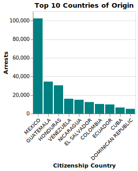
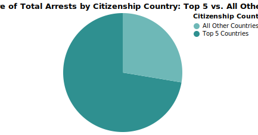

# ICE Deportations

Begum Akkas

## What is your current goal? Has it changed since the proposal?

I had to completely pivot my project because as I dug further into my data sources, I realized the fields I need to rely on were not sufficient. Furthermore, I was unable to construct any of the narratives I planned on across data sources. 

I found a rich dataset on ICE arrests in the last two years. My current goal is to shed light on this pertient issue by visualizing how arrests have changed over time, some demographic trends, and lastly insight into factors such as time taken between arrest and deportation. 

## Are there data challenges you are facing? Are you currently depending on mock data?

I was facing many data challenges however they were largely solved by switching datasets. I am considering incorporating a second census dataset for one of my visualizations, but I'm going to wait and see if I have time to do this. For my US map visualization, I want to normalize arrests with the state's population. I'd be curious to get your thoughts on whether this is worth doing.

## Describe each of the provided images with 2-3 sentences to give the context and how it relates to your goal.

There is definitely a lot of fine tuning I need to do to finalize these charts. However, I am holding off on doing that until I decide exactly which charts I want to use in my final deliverable. 

 

This show cumulative ICE arrests over time. I think I will only use either this chart or the line chart below. 

This is the count of ICE arrests monthly over time. I think I will use this over the cumulative chart because it shows that arrests were steady until Trump took office. The cumulative chart also has a consistent slope that indicates steady progress, but I think that's harder to interpret for the average audience member.

Here we can see which states have the largest number of deportations. I wanted to provide geographical context to this issue. I am considering creating a secondary chart of the same format that normalizes arrests by state population. 

This bar graph shows the citizenship status of the top 5 countries in the data. I aim to put this next to the pie chart below to show what share of the total data these five countries make up. 

This pie chart goes hand-in-hand with the bar graph above. I wanted to show that the top 5 countries make up a signifcant majority of total arrests. I may consider combining these two visualizations though, since both are quite simple. 

## What form do you envision your final narrative taking? (e.g. An article incorporating the images? A poster? An infographic?)

I think my final narrative will resemble either an infographic or article. I am aiming to do an article but it's going to depend on how much narrative I can bake into the charts. 